# CEH Notes

Thes are my notes for CEH.

# Module 3 : 

## TCP Flags :

- Syn :  notify a nw sequence number. (etablish connection)
- ACK : confirme la reception et identify the next expected sequence
- PSH : Start and end of data transmission.
- URG : Process the data asap.
- FIN : No more transmission will be send 
- RST : When there is an error. It abort the transmission

## Initialisation TCP
SYN -> SYN ACK -> ACK 

## Fin TCP 

FIN -> 
<- ACK
<- FIN
ACK ->

## Scanning Tools

- nmap
nmap /options/  /Target IP/

- Hping2/Hping3 
hping /options/ /target ip/

- Metasploit

- NetScanToolspro

### icmp scanning 
see of host are up by sending ping or icmp
hping3 -1 10.0.0.25 

### ACK scan on port 80
checking if there is a firewall that block the connections.
hping3 –A 10.0.0.25 –p 80

### UDP scan on port 80 

hping3 -2 10.0.0.25 –p 8

### Intercept all traffic containing HTTP signature

Ex. hping3 -9 HTTP –I eth0

### SYN flooding a victim 

hping3 -S 192.168.1.1 -a 192.168.1.254 -p 22 --flood 
The attacker employs TCP SYN flooding techniques using spoofed IP addresses to perform a DoS attack.

## Scanning for mobile

- IP Scanner

- Fing 

- Network Scanner

## Host discovery 

- ARP Ping Scan 

netmap -rp 

- UDP Ping scan

netmap -PU

## ICMP ECHO Ping Scan

Does icmp pass thgrough firewall ? ICMP ECHO -> ICMP ECHO

nemap -PE

## ICMP ECHO Ping Sweep

Slow method. 

### Tools for ping sweep 

- Angry IP Scanner

## Ping sweep contermeasure

- Configure well the firewall 
- use IDS 
- Carefully evaluate ICMP traffic
- Terminate connection with host that make more than 10 Echo requests
- Use DMZ with basic commands allowed 
- Use ACL's

## TCP SYN Ping Scan

- Machine can be scanned parallely 
- Determine if host is up without connection, so not recorded in logs.

## TCP ACK Ping Scan

Same as SYN but less firewall are configured to counter it.

## IP Protocol Ping Sca

Send a lot if different packets for ICMP.

nmap -PO

## Port Scanning Technique

### TCP Connect/Full Open Sca

Most reliable. Full tcp 3 way handshake. 
nmap -sT

### Stealth Scan

Abort before the end of the Handshake, it bypasses firewall and logging system.
nmap -sS

### Inverse TCP Flag Sca

Send FIN,URG or PSH flag, if port is open = no answer. If port closed = RST from host.

### SSDP and List Scanning
Simple Service Discovery Protocol (SSDP) is a network protocol that generally communicates with machines when querying them with routable IPv4 or IPv6 multicast addresses. 

## Os discorvery / Banner grabbing

### Active Banner Grabbing

Sending bad ICMP packets and comparing the response to a os base response database. 

### Passive Banner Grabbing

Instead of sendind packets and scanning, it sniff to study telltale that can reveal OS.

Avec le TTL et le WIndows Size on peut determiner l'OS

----------------

- Nmap
- Unicornscan
- Nmap NSE
- Wireshark

## Countermeasures 

- fisplay false banner
- only necessary service
- use ServerMask
- Hide file extension 

## Scanning Beyond IDS and Firewall

- **Packet Fragmentation**: The attacker sends fragmented probe packets to the intended target, which reassembles the fragments after receiving all of them.
- **Source Routing**: The attacker specifies the routing path for the malformed packet to reach the intended target.
-  **Source Port Manipulation**: The attacker manipulates the actual source port with the common source port to evade the IDS/firewall.
- **IP Address Decoy**: The attacker generates or manually specifies IP addresses of decoys so that the IDS/firewall cannot determine the actual IP address.
- **IP Address Spoofing**: The attacker changes the source IP addresses so that the attack appears to be coming from someone else.
- **Randomizing Host Order**: The attacker scans the number of hosts in the target network in a random order to scan the intended target that lies beyond the firewall.
- **Creating Custom Packets**: The attacker sends custom packets to scan the intended target beyond the firewalls.
- **Sending Bad Checksums**: The attacker sends packets with bad or bogus TCP/UPD checksums to the intended target
- **Proxy Servers**: The attacker uses a chain of proxy servers to hide the actual source of a scan and evade certain IDS/firewall restrictions.
- **Anonymizers**: The attacker uses anonymizers, which allows them to bypass Internet censors and evade certain IDS and firewall rules.

# Module 4 

*In the enumeration phase, attackers enumerate usernames and other information on the groups, network shares, and services of networked computers.*

## Techniques for Enumeration

- **Extract usernames using email ID** : username@domain
- **Extract information using default password**
- **Brute force Active Directory**
- **Extract information using DNS Zone Transfer** : Si on fais une zone transfert on peut avoir les info en clair
- **Extract user groups from Windows** : interface windows simple 
- **Extract usernames using SNMP** :  utiliser l'API SNMP.

## NetBios 

- The list of computers that belong to a domai
- The list of shares on the individual hosts in a network
- Policies and password

**NbstatUtility** : troubleshooting NETBIOS name resolution problems. Attackers use Nbtstat to enumerate information such as NetBIOS over TCP/IP (NetBT) protocol statistics NetBIOS name tables for both local and remote computers, and the NetBIOS name cache.

**Netbios Enumerator**  : API to enumerate infos 

**Nmap NSE**: tmtc nbstat.nse

## SNMP Enumeration 

SNMP enumeration tools are used to scan a single IP address or a range of IP addresses of SNMP-enabled network devices to monitor, diagnose, and troubleshoot security threats. 

**Management Information Base (MIB)** : MIB is a virtual database containing a formal description of all the network objects that SNMP manages.

**Communication process**

Host x request for active session -> host Y check if host x in MIB. if not send error to known host Z

## SNNMP Enumeration tools

**Snmpcheck** : contact, description, write access, devices, domain, hardware and storage information, hostname, Internet Information Services (IIS) statistics, IP forwarding, listening UDP ports, location, mountpoints, network interfaces, network services, routing information, software components, system uptime, TCP connections, total memory, uptime, and user accounts.

**SoftPerfect Network Scanner** : SoftPerfect Network Scanner can ping computers, scan ports, discover shared folders, and retrieve practically any information about network devices

## LDAP Enumeration

lighweight directory access procotol

**Softerra LDAP Administraton** : tools to enumerate every info in a ldap server

## NTP and NFS Enumeration 

### NTP 

Network time protocol

- List of connected hosts
- Client IP, Os and names
- Internal IP if NTP is in DMZ

| Command | Description |
| ----------- | ----------- |
| ntpdate | collects the number of time samples from several time sources. |
| ntptrace | This command determines where the NTP server obtains the time from and follows the chain of NTP servers back to its primary time source. Attackers use this command to trace the list of NTP servers connected to the network.  |
| ntpdc | This command queries the ntpd daemon about its current state and requests changes in that state. Attackers use this command to retrieve the state and statistics of each NTP server  |
| ntpq | This command monitors the operations of the NTP daemon ntpd and determines performance.   |

**PRTG Network Monitor** : PRTG monitors all systems, devices, traffic, and applications of IT infrastructure by using various technologies such as SNMP, WMI, and SSH.

### NFS 

Network file system
NFS is a type of file system that enables users to access, view, store, and update files over a remote server. 

| Command | Description |
| ----------- | ----------- |
| rpcinfo -p 10.10.10. | scan the target IP address for an open NFS port (port 2049) and the NFS services running on it |
| showmount -e 10.10.10.1 | view the list of shared files and directories  |

**RPCScan** : RPCScan communicates with RPC services and checks misconfigurations on NFS share.
Python3 rpc-scan.py 10.10.10.19 --rpc

**SuperEnum** : SuperEnum includes a script that performs the basic enumeration of any open port. 

## SMTP and DNS Enumeration

### SMTP Enumeration Too

**NetScanTools Pr** : NetScanTools Pro’s SMTP Email Generator tool tests the process of sending an email message through an SMTP server. Attackers use NetScanTools Pro for SMTP enumeration and extract all the email header parameters, including confirm/urgent flags. 

**smtp-user-enum** : smtp-user-enum is a tool for enumerating OS-level user accounts on Solaris via the SMTP service (sendmail). 

### DNS Enumeration Using Zone Transfer

DNS zone transfer is the process of transferring a copy of the DNS zone file from the primary DNS server to a secondary DNS server.
An attacker performs DNS zone transfer enumeration to locate the DNS server and access records of the target organization.

#### dig Command 

Attackers use the dig command on Linux-based systems to query the DNS name server.

| Command | Description |
| ----------- | ----------- |
| dig ns <target domain |retrieves all the DNS name servers of the target domain. Next, attackers use one of the name servers from the output of the above command to test whether the target DNS allows zone transfers. |
| dig @ axfr|  Next, attackers use one of the name servers from the output of the above command to test whether the target DNS allows zone transfers. |

**nslookup Command** : Attackers use the nslookup command on Windows-based systems to query the DNS name servers and retrieve information about the target .

**DNSRecon** :: Attackers use DNSRecon to check all NS records of the target domain for zone transfers.
dnsrecon -t axfr -d "target domain"

### DNS Cache Snooping

DNS cache snooping is a type of DNS enumeration technique in which an attacker queries the DNS server for a specific cached DNS record. By using this cached record, the attacker can determine the sites recently visited by the user.

### DNSSEC Zone Walking

Domain Name System Security Extensions (DNSSEC) zone walking is a type of DNS enumeration technique in which an attacker attempts to obtain internal records if the DNS zone is not properly configured.

**LDNS** : LDNS-walk enumerates the DNSSEC zone and obtains results on the DNS record files. 

**DNSRecon** : DNSRecon is a zone enumeration tool that assists users in enumerating DNS records such as A, AAAA, and CNAME. It also performs NSEC zone enumeration to obtain DNS record files of a target domain.

## IPsec Enumeration

IPsec is the most commonly implemented technology for both gateway-to-gateway (LAN-to-LAN) and host-to-gateway (remote access) enterprise VPN solutions. 

Attackers can perform simple direct scanning for ISAKMP at UDP port 500 with tools such as Nmap to acquire information related to the presence of a VPN gateway

nmap –sU –p 500 /target IP address/

Attackers can probe further using fingerprinting tools such as ike-scan to enumerate sensitive information, including the encryption and hashing algorithm, authentication type, key distribution algorithm, and SA LifeDuration. 

**ike-scan –M target gateway IP address**
- Discovery of host
- Fingerprinting -> IKe version, soft versions etc..
- Transform enumeration -> supported by the vpn
- User Enumertion
- Pre-shared key craking

## VoIP Enumeration

VoIP is an advanced technology that has replaced the conventional public switched telephone network (PSTN) in both corporate and home environments. 

Attackers use Svmap and Metasploit tools to perform VoIP enumeration. 

**Svmap** is an open-source scanner that identifies SIP devices and PBX servers on a target network.
**svmap (target network range)**

## RPC Enumeration

The remote procedure call (RPC) is a technology used for creating distributed client/server programs.

Attackers use the following Nmap scan commands to identify the RPC service running on the network : 

nmap -sR <target IP/network>
nmap -T4 –A <target IP/network>

Additionally, attackers use tools such as NetScanTools Pro to capture the RPC information of the target network. 

## Unix/Linux User Enumeratio

| Command | Description |
| ----------- | ----------- |
| rusers | rusers displays a list of users who are logged in to remote machines or machines on the local network. |
| rwho | rwho displays a list of users who are logged in to hosts on the local network. |
| finger | finger displays information about system users such as the user’s login name, real name, terminal name, idle time, login time, office location, and office phone numbers. |

							

## Telnet Enumeration 

As shown in the screenshot, the following Nmap command is used by attackers to enumerate the Telnet service running on the target system:
nmap -p 23 target domain

Attackers can further use the following script to enumerate information from remote Microsoft Telnet services with New Technology LAN Manager (NTLM) authentication enabled:

**nmap -p 23 --script telnet-ntlm-info **
 
Once the information about the target server is obtained, the attackers can use the following script to perform a brute-force attack against the Telnet server:

**nmap -p 23 –script telnet-brute.nse –script-args userdb=/root/Desktop/user.txt,passdb=/root/Desktop/pass.txt**

## SMB Enumeration

Server Message Block (SMB) is a transport protocol that is generally used by Windows systems for providing shared access to files, printers, and serial ports as well as remote access to Windows services.

As shown in the screenshot, attackers use the following Nmap command to enumerate the SMB service running on the target IP address: 
**nmap -p 445 -A target IP**

The STATE of PORT 445/tcp is OPEN, which indicates that port 445 is open and that the SMB service is running. By using this command, attackers can also obtain details on the OS and traceroute of the specified targe

## FTP Enumeration

The File Transfer Protocol (FTP) is used to transfer files over TCP, and its default port is 21. In FTP, data are transferred between a sender and receiver in plaintext, exposing critical information such as usernames and passwords to attackers. 

As shown in the screenshot, the following Nmap command is used by the attackers to enumerate the FTP service running on the target domain: 
**nmap -p 21 target domain**

## IPv6 Enumeratio

### Enyx 
Enyx is an enumeration tool that fetches the IPv6 address of a machine through SNMP.
As shown in the screenshot, attackers use the following command to enumerate the IPv6 address of a target machine (10.10.10.20) by setting the SNMP version to 2c and community string to public: 

**Python enyx.py 2c public target **

### IPv6 Hackit

Hackit is a scanning tool that provides a list of active IPv6 hosts. It can perform TCP port scanning and identify AAAA IPv6 host records.

###  BGP Enumeration

Attackers perform BGP enumeration on the target using tools such as Nmap and BGP Toolkit to discover the IPv4 prefixes indicated by the AS number and the routing path followed by the target.

 **nmap -p 179 target IP**
 
 ### NFS Countermeasures
 
 Network File System 
 
 - Implement proper permission in exported file systems
 - Implement Firewall to block NFS port 2049
 - Ensure proper configuration to protect data stored in server.
 - Keep root_squash in /etc/exports so no request in root are trusted
 - Implement NFS through SSH to encrypt data

### FTP Countermeasures

- Implement Secure FTP (SSH) to encrypt data over the network
- Implmenet strong password or certification baed authentification policy
- Restric the uploiading of file on server
- Disable anonymous FTP account.
- Restrict access by Ip or Domain
- Configure ACL's for FTP
- Restrict login attempt and time
- Configure filtering rules for FTP's
- Use SSL/FTPS for authenticated account

# Module 5

## Vulnerability-Management Life Cycl

- **Identify Assets and Create a Baseline** : identifies critical assets and prioritizes them to define the risk
- **Vulnerability Scan** : 	scan on the network to identify the known vulnerabilities in the organization’s infrastructure. 
- **Risk Assessment** : all serious uncertainties that are associated with the system are assessed and prioritized
- **Remediation** : Remediation is the process of applying fixes 
- **Verification** : re-scan of systems to assess if the required remediation is complete
- **Monitor** : 

## Vulnerability Classification

- **Misconfiguration**
- **Default Installations**
- **Open Services**
- **Default Password**

## Type of vulnerability Assessments

 | Command | Description |
| ----------- | ----------- |
| Active Assessment | uses network scanners to identify the hosts, services, and vulnerabilities present in a network. |
| Passive Assessment | sniff the traffic present on the network to identify the active systems, network services, applications, and vulnerabilities. |
| External Assessment | hacker’s point of view to identify exploits and vulnerabilities accessible to the outside world. |
| Internal Assessment | An internal assessment involves scrutinizing the internal network to find exploits and vulnerabilities. |
| Host-based Assessment | These assessments check the security of a particular network or server|
|Network-based Assessment | 	Network assessments determine the possible network security attacks that may occur on an organization’s system|
|Application Assessment |An application assessment focuses on transactional Web applications, traditional client-server applications, and hybrid systems. |
| Database Assessment | A database assessment is any assessment focused on testing the databases for the presence of any misconfiguration or known vulnerabilities.  | 
| Wireless Network Assessment | Wireless network assessment determines the vulnerabilities in an organization’s wireless networks.  |

## Comparing Approaches to Vulnerability Assessment

**Product-Based Solution** : install in organization network, can't always detect external attacks

**Service-Based Solutions** : offered by hird parties ( audit), drawback : hacker can audit networks

**Tree-Based Assessment** : different strategy for each machine/network

** Inference-Based Assessment ** : scanning starts by building an inventory of theprotocols found on the machine. After finding services, it selects vulnerabilities on each machine and starts to execute only those relevant tests

## Types of Vulnerability Assessment Tools

**Host-Based Vulnerability Assessment Tools** : 
The host-based scanning tools are appropriate for servers that run various applications.

**Depth Assessment Tools** : 
discover and identify previously unknown vulnerabilities in a system. 

**Application-Layer Vulnerability Assessment Tools** :  Web Servers and Database
Application-layer vulnerability assessment tools are designed to serve the needs of all kinds of operating system types and applications. Various resources pose a variety of security threats and are identified by the tools designed for that purpose.

**Scope Assessment Tools** : 
Scope assessment tools provide an assessment of the security by testing vulnerabilities in the applications and operating system. 

**Active and Passive Tools** : 
Active scanners perform vulnerability checks on the network functions that consume resources on the network.

Passive scanners are those that do not considerably affect system resources, as they only observe system data and perform data processing on a separate analysis machine.

** Location and Data Examination Tools ** : 

## Vulnerability Assessment Tools

**Qualys Vulnerability Management** : Cloud based very good.

**Nessus Professional** : scanning platform for auditors and security analysts.

**OpenVAS** :  framework of several services and tools that offer a comprehensive and powerful vulnerability scanning and vulnerability management solution.

**Nikto** : Nikto is an Open Source (GPL) web server scanner.

# Module 6

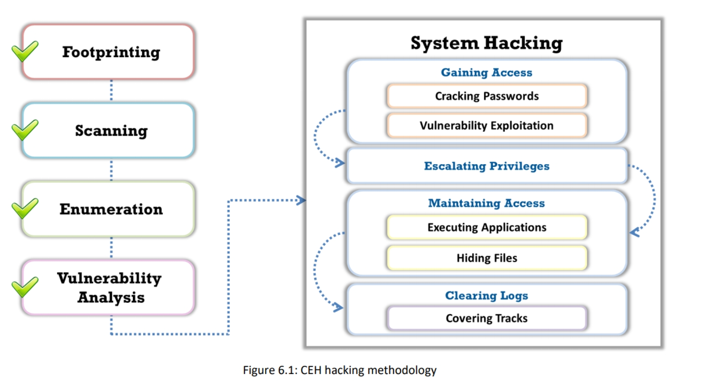

--- 

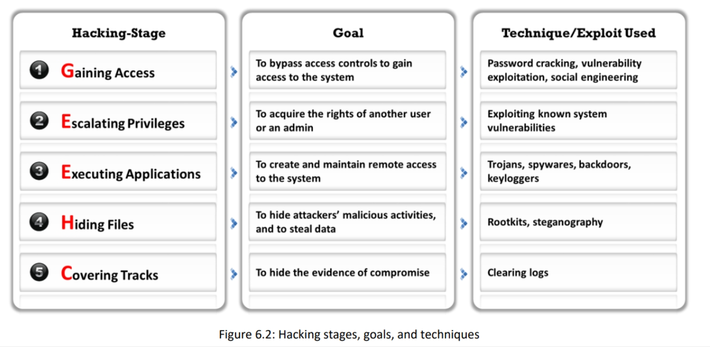

---

## Gaining Access

### Cracking Password

#### ***Microsoft Authentication***

***Windows uses the Security Accounts Manager (SAM)*** database or Active Directory Database to manage user accounts and passwords in hashed format. Difficult to hack.

***NTLM Authentication*** NT LAN Manager (NTLM) is a default authentication scheme that performs authentication using a challenge/response strategy. Because it does not rely on any official protocol specification, there is no guarantee that it works effectively in every situation. 

***Kerberos Authentication*** Kerberos is a network authentication protocol that provides strong authentication for client/server applications through secret-key cryptography. 

### How Hash Passwords Are Stored in Windows SAM

Windows OSs use a Security Account Manager (SAM) database file to store user passwords. The SAM file is stored at %SystemRoot%/system32/config/SAM 

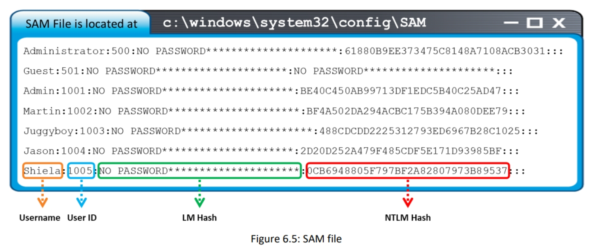

---

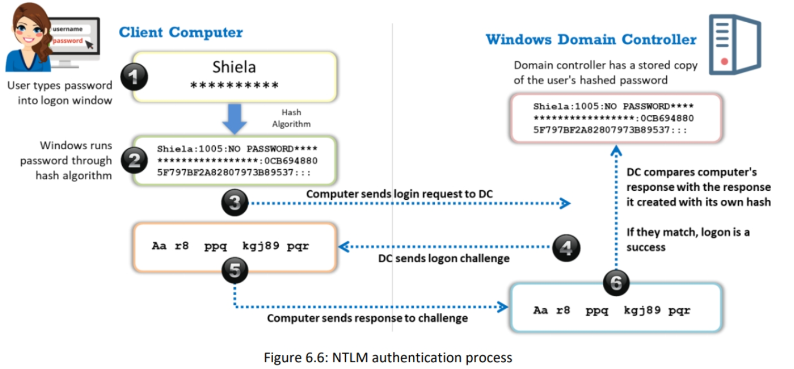

---

| Command | Description |
| ----------- | ----------- |
|non electric attack| shoulder surfing, social engineering|
|Active online attack| Communicate with machine try bruteforce, injection, malware, keyloggers etc...|
|Passive online Attack| sniffing the password by monitoring, replay attack, man in the middle|
|offline attack| recover from hash dump password a cleared text passwd.|

***rule based attacks*** : When you know the rules applied to password, you adapt your bruteforce to match the rules.

**trojan** : program that masks itself as a benign application.

**Spyware** is a type of malware that attackers install on a computer to secretly gather information 

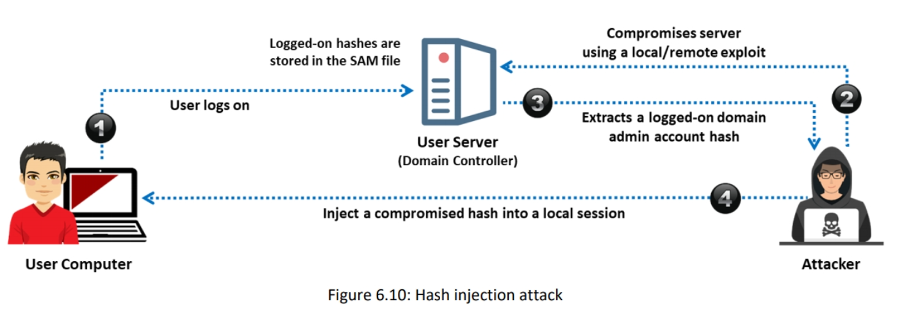

---

### LLMNR/NBT-NS Poisoning 

LLMNR (Link Local Multicast Name Resolution) and NBT-NS (NetBIOS Name Service) are two main elements of Windows OSs.

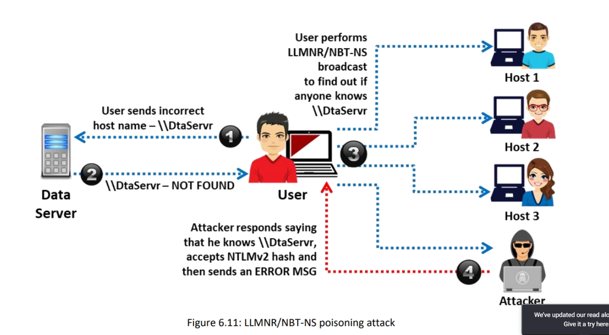

#### Tools : 

**Responder** : Responder is an LLMNR, NBT-NS, and MDNS poisoner. It responds to specific NBT-NS (NetBIOS Name Service) queries based on their name suffix. 

### Internal monologue attack 

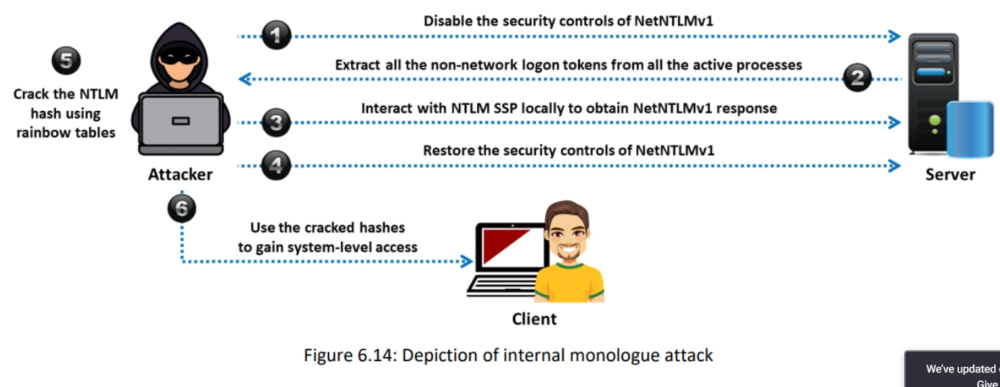

## Cracking Kerberos Passwords

### AS-REP Roasting  

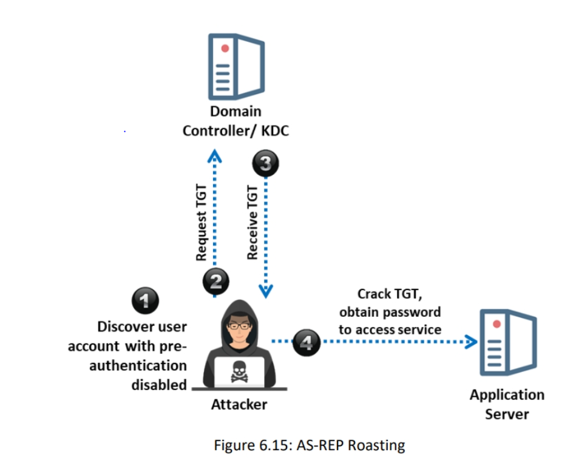

### Kerberoasting

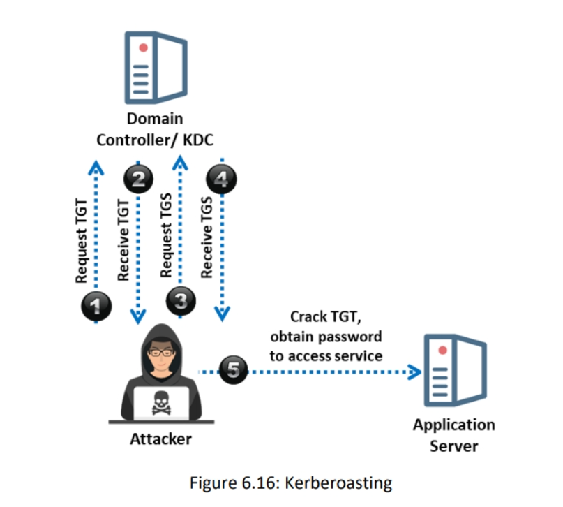

### Pass-the-Ticket Attack

**Mimikatz** : Mimikatz allows attackers to pass Kerberos TGT to other computers and sign in using the victim’s ticket. T

---

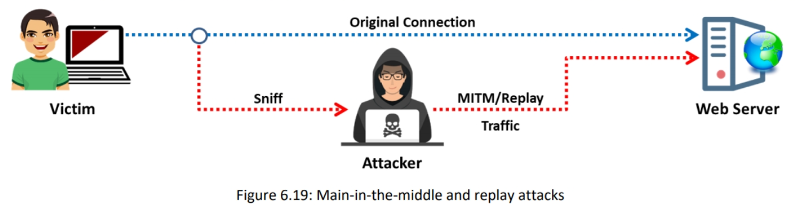

---

### **Rainbow Table**
A rainbow table is a precomputed table that contains word lists like dictionary files and brute-force lists and their hash values. 

### **Distributed Network Attack**
A Distributed Network Attack (DNA) is a technique used for recovering password-protected files that utilize the unused processing power of machines spread across the network to decrypt passwords. 

## Password Recovery Tools

**Elcomsoft Distributed Password Recovery** :
The Elcomsoft Distributed Password Recovery application allows attackers to break complex passwords, recover strong encryption keys, and unlock documents in a production environment.

## Password-Cracking Tools

**L0phtCrack** : L0phtCrack is a tool designed to audit passwords and recover applications. It recovers lost Microsoft Windows passwords with the help of a dictionary, hybrid, rainbow table, and brute-force attacks, and it also checks the strength of the password

**ophcrack** : Windows password-cracking tool 

**RainbowCrack** : Rainbow table user

## Password Salting

Password salting is a technique in which random strings of characters are added to a password before calculating the hashes. 

## How to Defend against LLMNR/NBT-NS Poisoning

The easiest way to prevent a system from being attacked by a perpetrator is to disable both the LMNR and NBT-NS services in the Windows OS. 

## Buffer overflow 

Stack quand alloation statique, Heap quand dinamique. 
EIP : adresse de retour
ESP : adresse sommet
EBP : adresse base
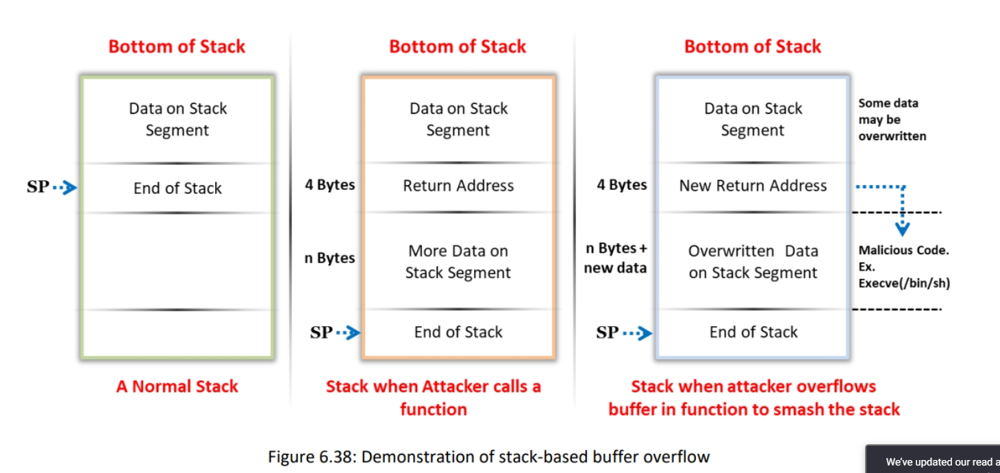

## Privilege Escalation Using DLL Hijacking

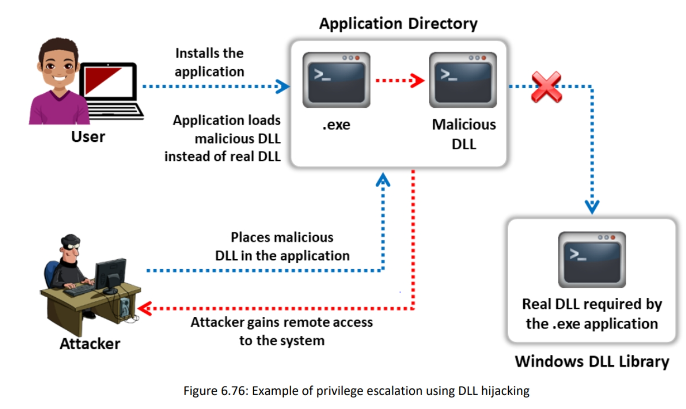

Attackers use tools such as **Robber** and **PowerSploit** to detect hijackable DLLs and perform DLL hijacking on the target system.

## Privilege Escalation using Spectre and Meltdown Vulnerabilities

Use new processor features to read restricted data.

## Privilege Escalation using Named Pipe Impersonation

In windows, process use file to send message to each other. 
In any Windows system, when a process creates a pipe, it will act as a pipe server. If any other process wants to communicate with this process, it will connect to this pipe and it becomes a pipe client. 

Attakcer uses metasploit to perform name pipi impersonation.

## Privilege Escalation Tools

**BeRoot** is a post-exploitation tool to check common misconfigurations to find a way to escalate privilege.

**linpostexp** tool obtains detailed information on the kernel, which can be used to escalate privileges on the target system.

## How to Defend Against Privilege Escalation

Restrict interactive logon privileges 
 Run users and applications with the lowest privileges 
 Implement multi-factor authentication and authorization 
 Run services as unprivileged accounts 
 Implement a privilege separation methodology to limit the scope of programming errors and bugs 
 Use an encryption technique to protect sensitive data 
 Reduce the amount of code that runs with a particular privilege 
 Perform debugging using bounds checkers and stress tests 
 Test the system for application coding errors and bugs thoroughly
 Regularly patch and update the kernel 
 Change UAC settings to “Always Notify,” so that it increases the visibility of the user when UAC elevation is requested
 Restrict users from writing files to the search paths for applications 
 Continuously monitor filesystem permissions using auditing tools 
 Reduce the privileges of user accounts and groups so that only legitimate administrators can make service changes
 Use whitelisting tools to identify and block malicious software that changes file, directory, or service permissions
 Use fully qualified paths in all Windows applications 
 Ensure that all executables are placed in write-protected directories 
 In Mac OSs, prevent plist files from being altered by users by making them read-only 
 Block unwanted system utilities or software that may be used to schedule tasks 
 Regularly patch and update the web servers
 Disable the default local administrator account 
 Detect, repair, and fix any flaws or errors running in the system services

---
rajouter les autres contre mesure

--

## Maintaining access 

**Backdoors**: Program designed to deny or disrupt the operation, gather information that leads to exploitation or loss of privacy, or gain unauthorized access to system resources.

**Crackers**: Components of software or programs designed for cracking a code or passwords.

**Keyloggers:** These can be hardware or software. In either case, the objective is to record each keystroke made on the computer keyboard

**Spyware**: Spy software may capture screenshots and send them to a specified location defined by the hacker. For this purpose, attackers have to maintain access to victims’ computers. After deriving all the requisite information from the victim’s computer, the attacker installs several backdoors to maintain easy access to it in the futur

### Exploitation for Client ExecutionExploitation for Client Execution

**Web-Browser-Based Exploitation**
Attackers target web browsers through spearphishing links and drive-by compromise. 

**Office-Applications-Based Exploitation**

**Third-Party Applications-Based Exploitation**

 ## Scheduled Task
 
 schedul malicious programme, for on boot for example.
 
 ## Service Execution
 
 System services are programs that run and operate at the backend of an OS. Attackers run binary files or commands that can communicate with Windows system services such as Service Control Manager.
 
 ## Windows Management Instrumentation (WMI)
 
 Attackers can use the WMI feature to interact with the target system remotely, and use it to perform information gathering on system resources and further execute code for maintaining access to the target system.

## Windows Remote Management (WinRM)

WinRM is a Windows-based protocol designed to allow a user to run an executable file to modify system services and the registry on a remote system. Attackers can use the winrm command to interact with WinRM and execute a payload on the remote system as a part of lateral movement.

## Tools for Executing Application

**RemoteExec** RemoteExec remotely installs applications, executes programs/scripts, and updates files and folders on Windows systems 

## keylogger

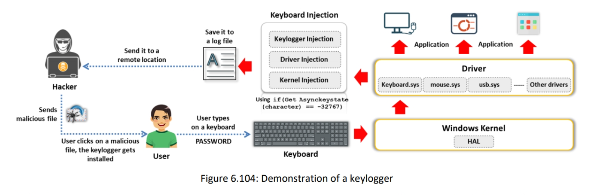

## Types of Spywar

**Desktop Spyware**

 Live recording of remote desktops
 Recording and monitoring Internet activities 
 Recording software usage and timings 
 Recording an activity log and storing it at one centralized location 
 Logging users’ keystrokes

**Email Spyware**

Email spyware is a program that monitors, records, and forwards all incoming and outgoing emails. 

**Internet Spyware**

Internet spyware is a tool that allows you to monitor all the web pages accessed by users on your computer in your absence.

**Child-Monitoring Spyware**
Child-monitoring spyware allows you to track and monitor what children are doing on the computer, both online and offline. 

**Child-Monitoring Spyware**
Child-monitoring spyware allows you to track and monitor what children are doing on the computer, both online and offline. 

**USB Spyware**
USB spyware is a program designed for spying on a computer, which copies spyware files from a USB device onto the hard disk without any request or notification. 

**Audio Spyware** 
Audio spyware is a sound surveillance program designed to record sound onto a computer.

**Video Spyware**

**Print Spyware**

**Telephone/Cellphone Spyware**

**GPS Spyware**

## Spyware Tools

**Spytech SpyAgent**

**Power Spy **

## Hiding files

**Rootkits** are software programs designed to gain access to a computer without being detected. They are malware that help attackers gain unauthorized access to a remote system and perform malicious activities. 

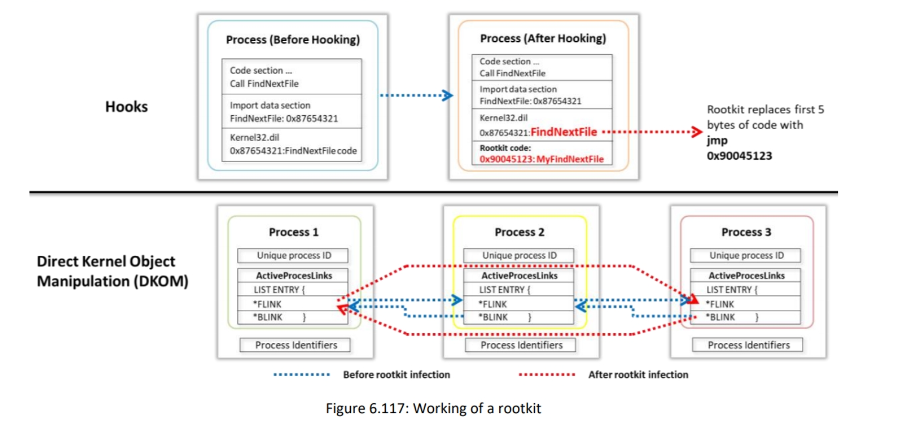

### Detecting Rootkits 

**Integrity-Based Detection**

Create a firest snapshot. Then check for dissimilarities regularly.

**Signature-Based Detection**

They compare the characteristics of all system processes and executable files with a database of known rootkit fingerprints.

**Heuristic/Behavior-Based Detection**

Heuristic-based detection works by identifying deviations in normal OS patterns or behaviors. 

**Runtime Execution Path Profiling**

Compares runtime execution path profiling of all system processes and executable files to a routine’s execution path to destabilize it.

**Cross-View-Based Detection **

The tools compare the gathered information with the dataset obtained using an algorithm to traverse through the same data. 

**Alternative Trusted Medium**

 In this technique, the infected system is shut down and then booted from alternative trusted media, such as a bootable CD-ROM or USB flash drive. 
 
 **Analyzing Memory Dumps**

In memory dump analysis, the volatile memory (RAM) of the suspected system is dumped and analyzed to detect the rootkit in the system. 

## NTFS Data Stream

NTFS is a filesystem that stores a file with the help of two data streams, called NTFS data streams, along with the file attributes. The first data stream stores the security descriptor for the file to be stored, such as permissions, and the second stores the data within a file.

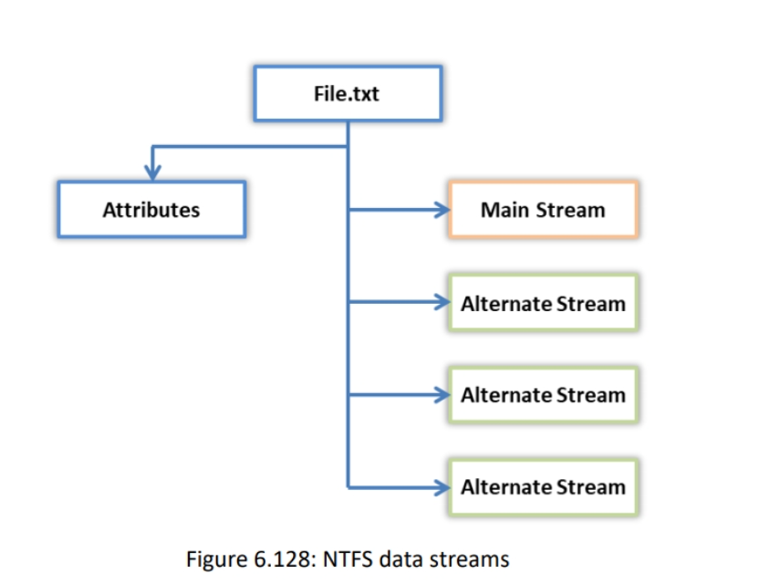

An ADS refers to any type of data attached to a file, but not in the file on an NTFS system.

![[Pasted image 20210225103303.png]]

